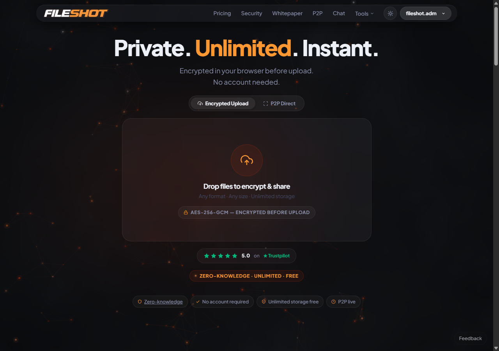

# FileShot Zero-Knowledge Encryption

Client-side, open-source zero-knowledge encryption used by [FileShot.io](https://fileshot.io).

All encryption happens in the browser via the Web Crypto API. The server receives only ciphertext — it never sees the key, the password, or the plaintext file.



---

## How the Zero-Knowledge Model Works

FileShot uses two modes of zero-knowledge encryption, both implemented in this library:

### URL-Fragment Mode (production default)

1. A cryptographically random 256-bit key is generated in the browser.
2. The file is encrypted with AES-256-GCM using that key.
3. Only the ciphertext is uploaded to the server.
4. The key is placed in the URL fragment (`#key=...`) of the share link.
5. The URL fragment is **never transmitted to the server** — browsers do not include fragments in HTTP requests by design.
6. The recipient decrypts entirely in-browser using the key from the URL.

The server is architecturally incapable of decrypting the file even under compulsion.

### Password Mode

Users may optionally set a password. The key is derived from the password via **Argon2id** (memory: 64 MB, iterations: 2, parallelism: 1) — a memory-hard KDF that resists GPU and ASIC brute-force attacks. The password itself is never transmitted. The recipient enters the password in their browser to decrypt.

Files encrypted before this migration used PBKDF2-SHA256 (100,000 iterations) and are still fully decryptable — the format version byte in the binary header selects the correct KDF automatically.

---

## Security Details

| Parameter | Value |
|-----------|-------|
| Cipher | AES-256-GCM |
| Key derivation (new) | **Argon2id** — memory: 64 MB, iterations: 2, parallelism: 1 |
| Key derivation (legacy) | PBKDF2-SHA256, 100,000 iterations (backward compat) |
| Salt | 32 bytes, random per-file (legacy: 16 bytes) |
| IV | 12 bytes, random per-encryption |
| Key size | 256 bits |
| Implementation | **hash-wasm** Argon2id (`zke-hash-wasm.bundle.js`) + Web Crypto AES-GCM |
| Crypto API | Web Crypto API (AES-GCM); KDF via hash-wasm (PBKDF2 legacy decrypt in Web Crypto) |

---

## Quick Start

### Try the Demo

1. Open `demo.html` in any modern browser.
2. Select a file and a password.
3. Click Encrypt — you get an encrypted blob.
4. Click Decrypt with the same password — you get the original file back.

No server involved. Works fully offline.

### Embed in Your Project

```html
<script src="zke-hash-wasm.bundle.js"></script>
<script src="zero-knowledge.js"></script>
<script>
const file = document.getElementById('fileInput').files[0];

// Encrypt
const { encryptedBlob, metadata } = await window.zeroKnowledgeEncrypt(file, 'strong-password');

// Decrypt
const decryptedBlob = await window.zeroKnowledgeDecrypt(
  encryptedBlob,
  'strong-password',
  metadata.originalName,
  metadata.originalType
);
</script>
```

---

## API Reference

### `zeroKnowledgeEncrypt(file, password)`

Encrypts a `File` or `Blob` client-side.

**Returns:**
```js
{
  encryptedBlob: Blob,          // AES-256-GCM ciphertext
  metadata: {
    originalName: string,       // Original filename
    originalSize: number,       // Original size in bytes
    originalType: string,       // Original MIME type
    encryptedSize: number       // Encrypted size in bytes
  }
}
```

### `zeroKnowledgeDecrypt(encryptedBlob, password, originalName, originalType)`

Decrypts an encrypted `Blob` client-side.

**Returns:** A `Blob` containing the decrypted file, with the original filename and MIME type.

---

## Encryption Pipeline

```
User selects file + password
      |
      v
Generate random 32-byte salt
Generate random 12-byte IV
      |
      v
Argon2id(password, salt, m=64MB, t=2, p=1) → 256-bit AES key
      |
      v
AES-256-GCM encrypt(file bytes, key, IV)
      |
      v
Output: [0x02][salt32][IV12][ciphertext+auth tag]
      |
      v
Only ciphertext leaves the browser

Legacy (PBKDF2) format: [salt16][IV12][ciphertext+auth tag]
(auto-detected on decrypt — no version byte present)
```

---

## File Structure

```
fileshot-zke/
├── zero-knowledge.js    # Core encryption/decryption library (Argon2id + PBKDF2 fallback)
├── demo.html            # Standalone browser demo
├── test-argon2id.html   # In-browser test suite
├── README.md
└── LICENSE              # MIT
```

---

## Browser Support

| Browser | Minimum Version |
|---------|----------------|
| Chrome | 37+ |
| Firefox | 34+ |
| Safari | 11+ |
| Edge | 12+ |
| Opera | 24+ |

All modern browsers support the Web Crypto API. No polyfills needed.

---

## Key Security Properties

- **No server-side keys.** The server stores only ciphertext and encrypted metadata.
- **No key transmission.** Keys travel only in URL fragments, which are stripped from HTTP requests.
- **No dependencies.** Argon2id is implemented in pure JS inline — no WASM, no npm packages, no CDN calls. AES-GCM uses the native `crypto.subtle` API.
- **Authenticated encryption.** AES-GCM includes a MAC — tampered ciphertext is rejected before decryption.
- **Forward secrecy per file.** Each file gets a unique salt and IV.

---

## Live Implementation

This library powers [FileShot.io](https://fileshot.io) — a zero-knowledge file sharing service.

**Plans:**

| Plan | File Size Limit | Storage | Price |
|------|----------------|---------|-------|
| Free | 10 GB per file | 50 GB total | $0 |
| Lite | 50 GB per file | Unlimited | $2/mo |
| Pro | 100 GB per file | Unlimited | $5/mo |
| Creator | 300 GB per file | Unlimited | $12/mo |

You can audit the encryption running in production at: [https://fileshot.io/verify-encryption.html](https://fileshot.io/verify-encryption.html)

---

## Desktop App

FileShot also has an open-source Electron desktop app: [github.com/FileShot/fileshot-desktop](https://github.com/FileShot/fileshot-desktop)

Features tray integration, drag-and-drop uploads, background transfers, and a virtual FileShot Drive.

---

## Security Policy

Report vulnerabilities privately: [fileshot.adm@gmail.com](mailto:fileshot.adm@gmail.com)

---

## Testing

Open `test-argon2id.html` in any modern browser and click **Run All Tests**. The suite covers:

- Argon2id encrypt + decrypt roundtrip
- Wrong-password rejection (GCM authentication failure)
- Distinct ciphertexts for different passwords (salt uniqueness)
- Legacy PBKDF2 file backward compatibility
- Binary format version byte verification

No server required — runs fully offline.

---

## License

MIT — see [LICENSE](LICENSE).

Copyright (c) 2025 FileShot.io
